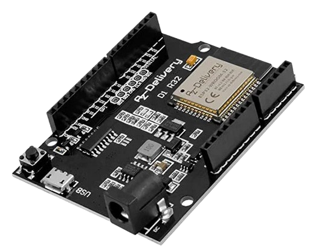

# Module-communication RF

<div align="center">

## A Propos
| Langage | Framework | OS |
|:-------:|:---------:|:--:|
|  |  |  |

## Status
| TX Build | RX Build | Clang-Format |
|:--------:|:--------:|:----------:|
|  |  |  |

[](vscode://file/c:/Users/thoma/Documents/Uni/communication-RF)

</div>

## Sommaire
- [Module-communication RF](#module-communication-rf)
  - [A Propos](#a-propos)
  - [Status](#status)
  - [Sommaire](#sommaire)
  - [Nomenclature](#nomenclature)
  - [Programme principal](#programme-principal)


**Objectifs :**

> [!NOTE]  
> Mettre en place une communication RF

## Nomenclature

  -  Carte [Wemos D1 R32](https://www.az-delivery.de/fr/products/esp32-d1-r32-board)
  


---

Cette activité est à réaliser avec **PlatformIO** pour une carte ESP32 avec le _framework_ **Arduino**.

Le fichier de projet `platformio.ini` :

```ini
[env:esp32dev]
platform = espressif32
board = esp32dev
framework = arduino
```

## Programme principal

Le fichier `src/main.cpp` initial :

```cpp
/**     // TO DO
 * @file main.cpp
 * @author your name
 * @brief 
 * @version 0.1
 * @date 2024-11-22
 * 
 * @copyright Copyright (c) 2024
 * 
 */
//////////////////////////////////////////////////////////////////////

#include <Arduino.h>

//////////////////////////////////////////////////////////////////////
void setup() {
   // TO DO
 }
//////////////////////////////////////////////////////////////////////
void loop() {
  // TO DO
}
```

---
&copy; 
Hnizdo Thomas 
